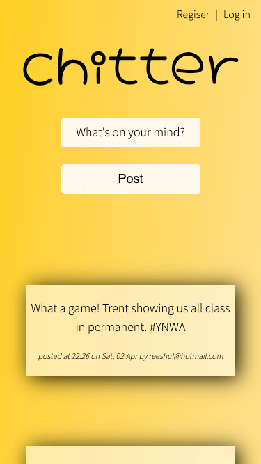
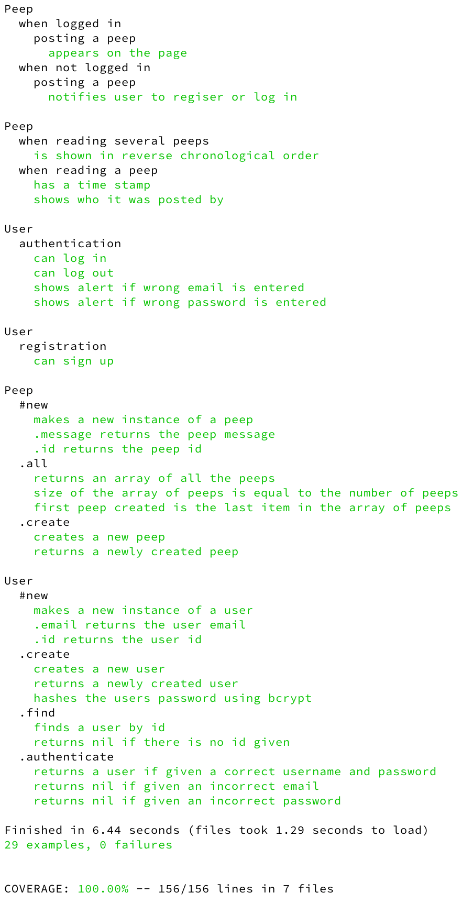

# Chitter

A platform where users can post messages ("peeps") to a public stream.

## Objective

Using TDD principles follow the MVC architecture to build an application that connects to a database.

## Technologies used

Ruby w/ Sinatra and PostreSQL. Tested using RSpec (unit) and Capybara (feature).

## User stories

```
As a Chitter user
So that I can let people know what I am doing
I want to post a message (peep) to Chitter

As a Chitter user
So that I can see what others are saying
I want to see all peeps in reverse chronological order

As a Chitter user
So that I can better appreciate the context of a peep
I want to see the time at which it was made

As a Chitter user
So that I can post messages on Chitter as me
I want to sign up for Chitter

As a Chitter user
So that only I can post messages on Chitter as me
I want to log in to Chitter

As a Chitter user
So that I can avoid others posting messages on Chitter as me
I want to log out of Chitter
```

## My approach

The idea was to complete the user stories in the order they were presented and test driving the code throughout, following the TDD cycle.

I first set up a testing environment to ensure the test cases could be run without interference. This meant `spec_helper.rb` had to be configured to connect to a separate test database, which would clear the tables before each test run.

I started with a peeps table which had two columns for the id (primary key) and the message to be posted.

The stories began with a `Peeps` class which had a `.create` method to insert the peeps into the table and a `.all` method to view them on the home page. I later added a `time_posted` column to the table to store the timestamps.

After the first three I created another table for the users and a corresponding class. This was for registration and authentication. To associate the peep with who posted it I added a `user_emails` column to the peeps table.

I also considered some unhappy paths - such as the user entering incorrect details or posting a peep if not logged in. This was accounted for in the controller logic (`app.rb`) where the user would be notified accordingly.

Lastly I added some styles. Although not really the main purpose of the project I enjoyed adding some transitions to the input fields and using keyframes to animate the alerts.

---

## Setting up the app

#### Download repo and install packages

- Clone repo `git clone https://github.com/reeshul/chitter`
- Change directory `cd chitter`
- Install gems `bundle`

#### Development Database Setup

- Connect to psql `psql`
- Create a development database `CREATE DATABASE chitter;`
- Connect to the database `\c chitter;`
- Run the commands in the `db/migrations` directory
- Exit psql `\q`

Optional - to run the tests a test database will also need to be set up. Create another database called `chitter_test` following steps 4-8 above again.

#### Using the app

- Run local server `ruby app.rb`
- Open browser and head to `http://localhost:4567`



---

## Test Coverage



A coverage report can be viewed [here](./demo/coverage-report.html)

---

## What next for Chitter

- User story: users can delete their own peeps
- User story: users 'like' peeps
- User story: users can reply to peeps
- User story: users can follow other users
- Deploy the project on a server
- Add CI/CD - building a deployment pipeline, which runs the linter and code coverage tests and ensures the app is only deployed if all of these are passing
